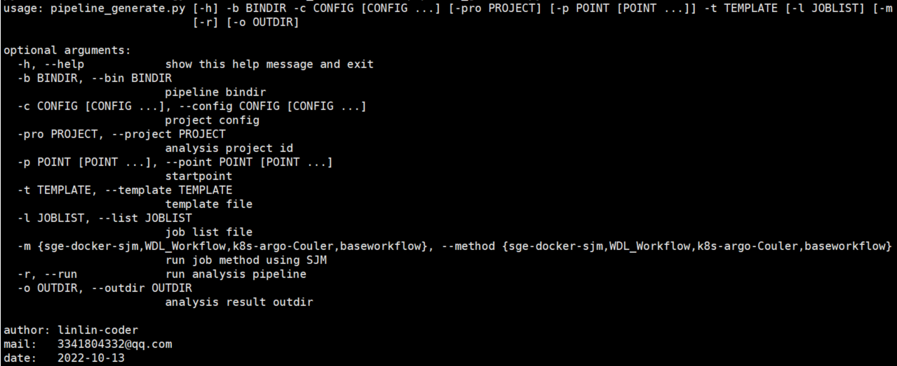
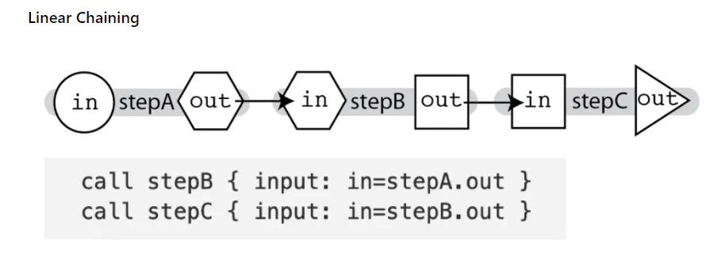
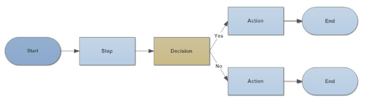
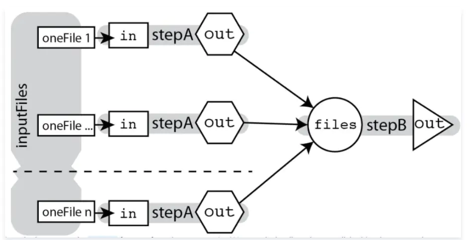
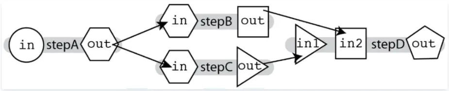
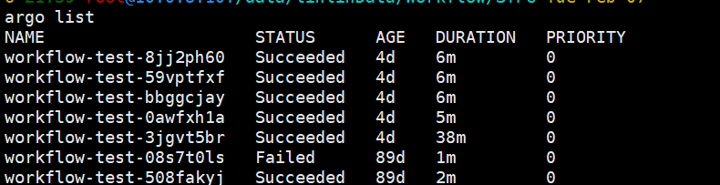
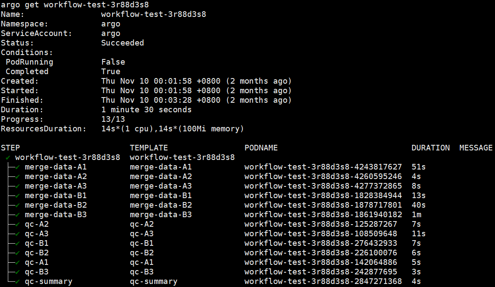
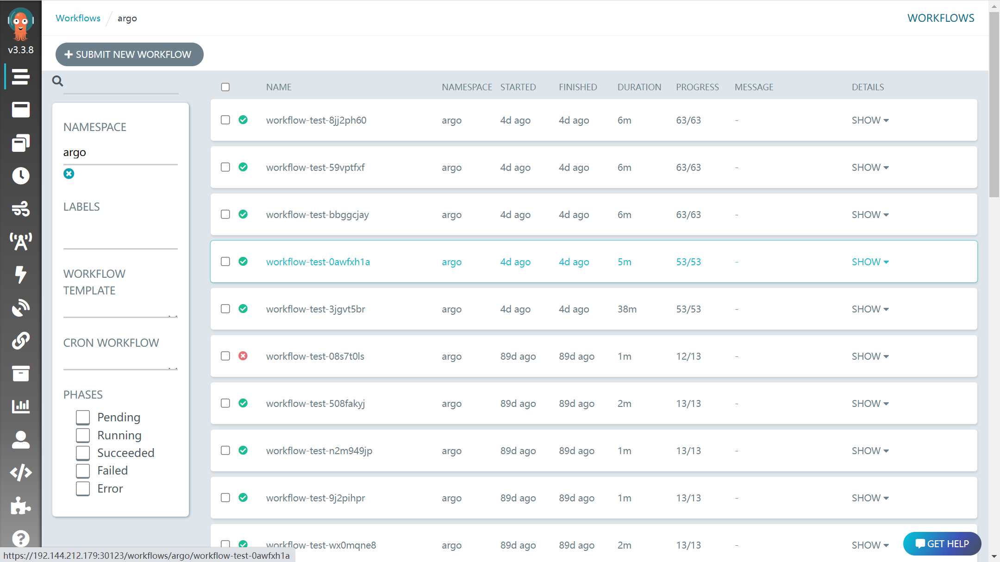
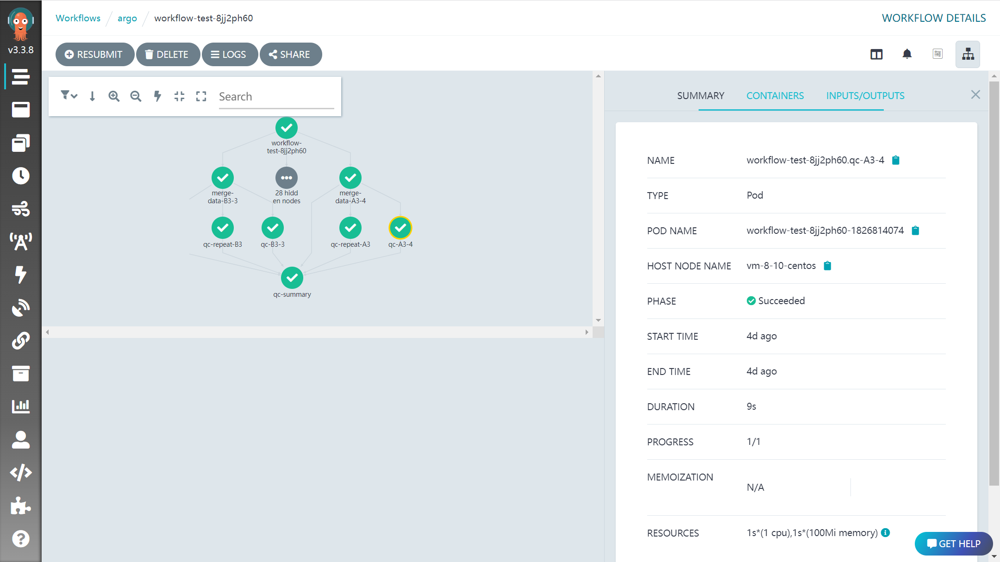

# Standard Pipeline Generation Technology(SPGT,标准流水线模板生成技术) 

# STPG 使用说明文档
# 工具简述
STPG的核心使命是“以统一模板，按编码解码的的方式实现任务流的构造、运行与监控”，一次代码编写可以投递至不同的分析平台，且在流程构造逻辑上极大简化，便于快速开发和快速上线。STPG最大的特点是将流程中的每一个任务单元转换为有向无环图中的节点，通过深度优先搜索的策略找到任务流中节点间的上下游依赖，再通过解码器解码为对应集群平台的可投递代码，本质上来说，STPG是通过按编码解码的的方式构造任务流。  
STPG的开源地址为：https://github.com/linlin-coder/STPG
## 工具安装
STPG是一个python工程，安装方式如下：
```
# 安装
git clone https://github.com/linlin-coder/STPG.git
cd STPG
pip3 install -r requirements.txt -i http://pypi.douban.com/simple/ --trusted-host=pypi.douban.com/simple

# 测试，出现以下参数界面说明安装成功
python3 ./src/pipeline_generate.py -h
```

## 什么是按编码解码的的方式构造任务流
以python脚本为例，我们都知道脚本不能脱离python解释器而独立运行，脚本里的代码为编码前的状态，经过解释器处理的机器代码为编码后的，能直接在物理机上运行。  
类比于以上的示例，这里我们把初始定义的称为编码前的任务流，经过解析工具生成特定环境下可投递任务流称为编码后的任务流，相较于以往直接编写任务流具有以下几点突出的优势。  
1. 与流程无关
在编码解码的思想下，我们编写解码工具的核心便不是流程如在对应平台投递上的适配，而是如何定义流程的书写规则，所有流程共同遵守一套规则，1. 可以实现用工具解码后的流程为可投递流程； 2. 规则一定，便于流程负责人更关注流程的逻辑，生成结果的意义，而不是如何正常的创建流程； 3. 提供统一的文件格式输入，便可以正常的创建流程，与流程解耦合。  
此情况下，解码工具的开发维护，和流程本身的开发维护就可以分开进行，分工产生效能。
2. 与项目无关
首先我们需要定义项目的含义，项目是指使用特定流程对特定的对象进行有逻辑、有意义的数据分析，最终交付运行结果和出具运行报告的。  
特定的项目在代码层面，表现为可变的参数输入，不同的项目我们通过读取配置文件中的信息即可实现流程对不同项目的使用。  
3. 与特定的集群类型解耦，按需求生成对应的任务流
不同的集群所接受的任务流定义文件是不一样的，一般情况下流程运行过程如下：
```
流程 + 项目 → 流程资源定义文件  → 投递器 → HPC
```
但是，这种模式中流程是根据具体的任务投递器和HPC架构进行设计的，很难对其他任务投递器和HPC架构进行兼容。 我们可以重新设计以上的逻辑，加入共用的解码工具，实现流程的扩展：
```
# 先生成适用环境的流程模板，在根据具体项目生成项目对应的运行流程
初始流程模板 + 共用解码工具  → 适用环境的流程模板 + 项目 → 流程资源定义文件  → 投递器 → HPC
# 一步到位，根据项目、流程模板和共用解码工具生成运行流程
初始流程模板 + 共用解码工具 + 项目 → 流程资源定义文件  → 投递器 → HPC
```
4. 流程模块化，资源定义更清晰
原来我们可能将功能写在python、perl、R或shell等脚本中，既不便于功能升级，也及其依赖解释器。  
业务代码（底层代码）使用python、perl等语言编写无法更改，但建议业务代码的串联工具推荐使用makefile作为技术进行使用，1. 模块化，在makefile中定义不同的target即可定义任何自己需求的模块，2. 扩展性高， 可以直接读取配置文件获取变量，也可以通过参数定义的方式获取变量。  
5. 运行代码与运行结果关联
这里提倡的方式是运行代码目录与分析结果目录存放一致，便于task异常后的手动排错。  
## 传统流程如何拆分
这里，我们把流程定义为以下资源的集合，资源分离后可以实现各个部分的独立部署，并分离升级热点
```
流程 = 流程代码 + 数据库 + 环境
```
1. 流程代码
这里我们推荐使用gitlab管理组织内部的代码，迭代热点较高，并创建在局域网内，局域网外访问可通过Nginx代理访问。
2. 数据库
一般而言又可以分为静态资源和动态资源，一般存放至硬盘和内存中，迭代热点较低。
3. 环境
由于各类集群的差异，安装在集群的软件可能因各种环境的差异而导致使用异常，这里我们推荐使用容器技术进行环境封装，一般常用的为docker，迭代热点居中。
## STPG的优势
* 单个配置文件，便于所有模块查询
* 模块分级，整理有序，依赖清晰
* 代码易查阅，所有代码可以标注在makefile或直接填写，输出路径填充固定变量，不用牢记输出
* 输出脚本为shell，makefile自动解析
* 分析软件置于底层，可单独运行
* 全局查看流程
* 模块的依赖、资源、代码等定义在一块，快速填充、增删改查
## 工具参数介绍
STPG对外提供丰富的接口参数，包括对流程和对项目的，具体如下：

| 参数形式1 | 参数形式2 | 参数说明                          | 一般实例    | 备注                                                                 |
| --------- | ---------- | ------------------------------------- | --------------- | ---------------------------------------------------------------------- |
| -b        | --bin      | 流程根目录，用于填充yaml模板中的{BIN} | -               | 必选项，当流程迁移至其他目录后仅需修改该参数可以使流程正常运行 |
| -c        | --config   | 项目变量配置文件              | project.ini     | 必选项，INI格式，用于随项目而更改的变量填充，如样本信息 |
| -pro      | --project  | 项目编号                          | test-project    | 必选项，字符串格式                                            |
| -t        | --template | 流程运行模板                    | pipeline.yaml   | 必选项，YAML格式，和流程相关的变量，如数据库配置信息 |
| -m        | --method   | 流程运行方式                    | k8s-argo-Couler | 必选项，基于argo引擎向K8S集群投递任务                   |
| -o        | --outdir   | 结构化流程的输出目录        | .               | 必选项，相对路径或绝对路径，不存在时则创建        |
| -l        | --list     | 任务模块选择文件              | joblist.yaml    | 必选项，YAML格式，选定流程中那些模块进行分析，扩展流程的个性化分析能力 |
| -p        | --point    | 流程进入点                       | job1            | 挑选流程运行模板的哪一个job或module作为运行起始点进行分析 |
| -r        | --run      | 启动运行                          | -r              | 可选项，填充时启动投递程序，不填充则只打印脚本和流程，不投地 |
## 最小执行单元的属性
在流程模板中，最小的执行单元为投递时一个分析任务，为了对单个任务的运行做精细化控制，对有向无环图上的每一个节点添加了如下属性：

| 属性名称 | 属性中文概览 | 类型       | 描述                                                                                                                                                                                                                                                                                                                                                                                                                                                                                                                                                                                                                                                                                                                                                                                                       |
| ----------- | --------------- | ------------ | ------------------------------------------------------------------------------------------------------------------------------------------------------------------------------------------------------------------------------------------------------------------------------------------------------------------------------------------------------------------------------------------------------------------------------------------------------------------------------------------------------------------------------------------------------------------------------------------------------------------------------------------------------------------------------------------------------------------------------------------------------------------------------------------------------------ |
| Name        | 名称          | 字符串    | 定义的任务基础名称                                                                                                                                                                                                                                                                                                                                                                                                                                                                                                                                                                                                                                                                                                                                                                                  |
| Module      | 所属分析模块 | 字符串    | 是否有和其他任务处于相同的分析模块内                                                                                                                                                                                                                                                                                                                                                                                                                                                                                                                                                                                                                                                                                                                                                       |
| Queue       | 队列          | 字符串    | 在集群中，选择那个队列进行任务投递                                                                                                                                                                                                                                                                                                                                                                                                                                                                                                                                                                                                                                                                                                                                                          |
| CPU         | CPU数          | 整形       | 指定最大消耗CPU数                                                                                                                                                                                                                                                                                                                                                                                                                                                                                                                                                                                                                                                                                                                                                                                     |
| Memory      | Memory          | 字符串    | 指定最大消耗Memory数                                                                                                                                                                                                                                                                                                                                                                                                                                                                                                                                                                                                                                                                                                                                                                                  |
| Depend      | 依赖          | 列表[字符串] | 是否有对上层模块或任务的依赖                                                                                                                                                                                                                                                                                                                                                                                                                                                                                                                                                                                                                                                                                                                                                                   |
| Command     | 执行命令    | 列表[字符串] | 该模块内执行的命令模板，command中可以直接以{job.属性名}的方式调用该模块的任何一个属性，例如CPU：{job.CPU}<br>Command中可用的变量为<br>* 当前JOB的任何一个属性，例如CPU：{job.CPU} 或 {job.Memory}<br>* 流程yaml文件中resource定义的变量，例如{resource.software.perl}的方式进行使用<br>* 项目config.ini文件中，在[Para]或[DB]中定义的变量，如填充Para_test这样的方式使用<br>* 提供{MainModule}、{ChildModule}变量，用于创建输出目录或其他<br>* 提供{BIN}变量，用于填充命令行--bindir参数<br>* 提供{OUTDIR}变量，可用于定义结果的输出目录<br>* Part与SecondPart，用于使用项目config.ini文件中不同的section信息，使用方式如{Part[0]}、{Part[1]}等，其中0、1表示列表索引，第0列代表section的sub-key，1、2...代表用TAB分割的第几列（从1开始）<br>注意事项：<br>* bash里的变量，用${}标记时请使用${{}}方式，如```export PATH=${{PATH}}:/bin/``` |
| Input       | 输入          | 列表[字符串] | 文件或变量的输入                                                                                                                                                                                                                                                                                                                                                                                                                                                                                                                                                                                                                                                                                                                                                                                     |
| Output      | 输出          | python对象 | 文件或变量的输出                                                                                                                                                                                                                                                                                                                                                                                                                                                                                                                                                                                                                                                                                                                                                                                     |
| Env         | 环境变量申明 | 字符串    | 将添加的环境变量信息加载至容器初始化阶段（注：暂时未启用该属性，忽略）                                                                                                                                                                                                                                                                                                                                                                                                                                                                                                                                                                                                                                                                                                    |
| Mount       | 路径挂载    | 列表[字符串] | 将本地的那些路径挂载至容器中                                                                                                                                                                                                                                                                                                                                                                                                                                                                                                                                                                                                                                                                                                                                                                   |
| Image       | 镜像使用信息 | 字符串    | 执行命令时，使用的镜像信息                                                                                                                                                                                                                                                                                                                                                                                                                                                                                                                                                                                                                                                                                                                                                                      |
| Status      | 运行状态    | 字符串    | 记录任务是否开始运行，运行中，或运行后是否正常退出                                                                                                                                                                                                                                                                                                                                                                                                                                                                                                                                                                                                                                                                                                                                  |
| Description | 任务描述    | 字符串    | 对该分析内容做描述                                                                                                                                                                                                                                                                                                                                                                                                                                                                                                                                                                                                                                                                                                                                                                                  |
| Shell_dir   | 脚本输出目录 | 字符串    | 可选，默认创建目录并输出                                                                                                                                                                                                                                                                                                                                                                                                                                                                                                                                                                                                                                                                                                                                                                         |
| Part        | 迭代执行sector1 | 列表[字符串] | 是否对某一个系列的变量的每一个单元对应分析，可用于Depend、Command、Output和QC中的使用，基本方式为{Part[0]}                                                                                                                                                                                                                                                                                                                                                                                                                                                                                                                                                                                                                                                             |
| SecondPart  | 迭代执行sector2 | 列表[字符串] | 是否对sector1的每一个元素循环执行sector2构造起来的命令，实现双重循环的机制，但是分析时是并行投递的，可用于Depend、Command、Output和QC中的使用，基本方式为{SecondPart[0]}                                                                                                                                                                                                                                                                                                                                                                                                                                                                                                                                                                          |
| QC          | 自动质控    | 列表[字符串] | 按照已有规则对可读文本做自动质控，并出具自动质控报  |


单个任务参考示例：
```
JOB_Demo:
    Queue: "test.q"
    Shell_dir: "{OUTDIR}/shell" # if you want to control shell output dir to Specified directory, global sign this attrabution
    CPU: 1
    Memory: "10G"
    Image: "ubuntu:22.10"
    Mount: 
        - "/share/public/:/share/public/:ro"
        - "/data/:/data/"
    Part:
        - sample
        - sample2
    SecondPart:
        - chromosome
    Depend:
        - TaskA
    Command: 
    - |
        mkdir -p {OUTDIR}/{MainModule}/{ChildModule}/{Part[0]}
        {resource.software.make} -f {BIN}/Modules/QC.mk   outdir={OUTDIR} MainModule={MainModule} ChildModule={ChildModule} sample_id={Part[0]} merge_data
        {resource.software.python3} --version
        echo "my\topi\n" > test.sh
    - "whoami"
    Output:
        A1: "{OUTDIR}/{MainModule}/{ChildModule}/{Part[0]}/{Part[0]}_{SecondPart[0]}.anno.txt"
    Env: "export PATH=/bin/path"
    Description: "this is a demo job"
    QC:
        - "A1|{OUTDIR}/{MainModule}/{ChildModule}/{Part[0]}/{Part[0]}_{SecondPart[0]}.anno.txt|table|column7>=75,column8<=20"
```
# 构建Pipeline
## Pipeline基本架构
一般运行实例如下：
```
python3 ./src/pipeline_generate.py \
    -b ${your_pipeline_bin} \
    -c Config.ini \
    -pro test \
    -t ${your_pipeline_bin}/Pipeline.yaml \
    -l ${your_pipeline_bin}/Joblist.yaml \
    -m sge-docker-sjm \
    -o ${your_output_dir} \
    -r
```

## 项目Config.ini构造
这个文件是与项目变更而不同的变量配置文件，例如样本信息，染色体分析列表，示例文件如下：
场景：
1. 某个分析任务对每一个样本都做同样的分析，则可以在该分析任务的属性Part添加上sample
1. 对每一个样本的每一条染色体做同样的分析，则可以在该分析任务的属性Part添加上sample，SecondPart添加上chromosome
1. DB_test、Para_test可以在分析任务模板的Command属性中直接填充，工具会自动做替换
```
[sample]
A1=B2-S.R1.fastq.gz B2-S.R2.fastq.gz
A2=B1-S.R1.fastq.gz B1-S.R2.fastq.gz
A3=S.R1.fastq.gz    S.R2.fastq.gz

[Type]
one=1
two=2
three=3

[DB]
DB_test=test

[Para]
Para_test=test
```
## 流程Pipeline.yaml构造
Pipeline.yaml中含有三个最顶层的结构
* resource
resource为变量配置区，除开`sign`和`software`外，其他均可进行增删改，`software`也可以进行增加，但是不能删除这个section。这些变量可以直接用在每一个JOB的Command区域中，工具会智能替换，例如software中的python3的使用；另外我们可以自行添加section，例如我们可以创建image，并添加python3的image信息。    
resource中的sign不能修改，这是为自动质控进行的格式配置  
```
resource:
    sign:
       finish_sign: "finished"
       qc_sign: "Name|Path|Type|Order"
       qualify: "True:qualified|False:<font color=\"red\">unqualified</font>"    
    software:
       python3: /usr/local/bin/python3
       perl: "/usr/bin/perl"
       docker: "/usr/bin/docker"
    image:
        python3: "python:alpine3.6"
pipeline:
    Module:
        JOB_Demo:
            Command: 
            - |
                {resource.software.perl} -h
                {resource.software.python3} --version
                docker run {resource.image.python3} python3 -h
```
* default
这里配置每一个JOB在初始化的时候默认填充的值，例如默认给CPU而Memory的值，不必要在每一个JOB里重复填充。
需要注意的是，**当Shell_dir定义时，所有的shell均输出到该目录下，请一定注意。**
```
default:
    Queue: "test.q"
    Shell_dir: "{OUTDIR}/shell"
    CPU: 1
    Memory: "100M"
    Image: "ubuntu:22.10"
    Mount: 
        - "/share/public/:/share/public/:ro"
        - "/data/:/data/"
```
* pipeline
在pipeline区域填充整个流程的代码，并按照如下的架构进行搭建：
```
pipeline:
    parent_module:
        children_module1:
            Command:
            Depend
        children_module2:
        children_module3:
```
## 流程Joblist.yaml构造
这个文件填写是基于pipeline.yaml文件的，例如对如上pipeline的如下JOB进行流程创建与分析，
```
QC:
  - merge_data
  - qc
  - qc_summary
```
如果对QC这个Module下的所有JOB进行分析则可以填充如下
```
QC:
```
## 依赖关系设置：一对一依赖
示例书写如下，实现每一个样本的stepB依赖stepA：

```
pipeline:
    QC:
        stepA:
            Part:
                - sample
            Depend:
                -
        stepB:
            Part:
                - sample
            Depend:
                - stepA_{Part[0]}
```
## 依赖关系设置：多对一依赖
示例书写如下，实现每一个样本的stepB依赖stepA，stepC依赖stepA：


```
pipeline:
    QC:
        stepA:
            Part:
                - sample
            Depend:
                -
        stepB:
            Part:
                - sample
            Depend:
                - stepA_{Part[0]}
        stepC:
            Part:
                - sample
            Depend:
                - stepA_{Part[0]}
```
## 依赖关系设置：一对多依赖
* 情况一：实现每一个样本的stepB依赖若干个stepA，示例书写如下

```
pipeline:
    QC:
        stepA:
            Part:
                - sample
            Depend:
                -
        stepB:
            Depend:
                - stepA
```
* 情况二： 实现stepD依赖stepC，stepD依赖stepB


```
pipeline:
    QC:
        stepB:
            Part:
                - sample
            Depend:
                -
        stepC:
            Part:
                - sample
            Depend:
                - 
        stepD:
            Part:
                - sample
            Depend:
                - stepC_{Part[0]}
                - stepB_{Part[0]}
```
* 情况三：某一个JOB依赖pipeline中的某一个Module，例如MP2中的stepD依赖QC中的每一个JOB
```
pipeline:
    QC:
        stepA:
            Part:
                - sample
            Depend:
                -
        stepB:
            Part:
                - sample
            Depend:
                - 
        stepC:
            Part:
                - sample
            Depend:
                - stepA_{Part[0]}
                - stepB_{Part[0]}
    MP2:
         stepD:
            Part:
                - sample
            Depend:
                - QC
```
* 情况四：Part与SecondPart属性均设置时（构成双层循环），如下示例，stepB对stepA的内层循环的依赖，stepC对stepA的外层循环的依赖
```
pipeline:
    QC:
        stepA:
            Part:
                - sample
            SecondPart:
                - chromosome
            Depend:
                -
        stepB:
            Part:
                - sample
            SecondPart:
                - chromosome
            Depend:
                - stepA_{Part[0]}_{SecondPart[0]}
        stepC:
            Part:
                - sample
            Depend:
                - stepA_{Part[0]}

```
最新特性
## Command中make命令将自动解析
JOB中如果使用makefile做命令包装，工具将自动在命令后-n，解析出的命令行将替换原来make语句的位置处。这样的好处是开发者在makefile中模块化的编写命令，使用者在查阅脚本时能直接看到最里层的命令，阅读和排错的步骤更加直接。
## `基于JOB的Output属性进行任务隔离
在编写流程时，必须要考虑到上下游文件的依赖关系，以前的工具需要用绝对路径进行指定，JOB间的耦合性过高，不利于扩展。STPG基于Output传递每个JOB的输出，在模块修改时不必要担心对其他模块的扰动和影响。  
以下示例展示了Output如何实现JOB间的解耦合  
* stepC使用stepB同一个样本的A1结果
* stepD使用stepB所有样本的A1结果，文件间用","进行分隔
  * 当程序中想一下“ ”作为分隔符时，参见stepD的Command第二种写法，需要注意">" 与"|"间必须用空格进行分割；
```
pipeline:
    QC:
        stepB:
            Part:
                - sample
            Output:
                A1: "file1"
        stepC:
            Part:
                - sample
            Command:
                - "<stepB_{Part[0]}.Output.A1>"
        stepD:
            Command:
                - "<stepB.Output.A1>"
                - "cat ` echo <stepB.Output.A1> |sed 's/,/ /g'` > all.txt"
```
## 实现结果的自动质控与报告出具
JOB具有QC属性，可以对指定的文件进行数据质控，第一列为报告中显示的名称，第二列为文件的绝对路径，第三轮为文件属性（表格table，普通文件file），第四列为质控标准。  
* 当第三列，file属性，第四列值为exist，则表明检测该文件是否存在
* 当第三列，table属性，第四列值为表达式，则先进行计算，然后观察是否满足调节，多个判断条件间用","分隔
示例如下：  
* A1文件，表格，检测第7列是否均大于75，第8列是否均小于20
* A2文件，普通文件，检测是否存在
```
JOB_Demo:
    QC:
        - "A1|{OUTDIR}/{MainModule}/{ChildModule}/{Part[0]}/{Part[0]}_{SecondPart[0]}.anno.txt|table|column7>=75,column8<=20"
        - "A2|{OUTDIR}/{MainModule}/{ChildModule}/{Part[0]}/{Part[0]}_{SecondPart[0]}.mark.txt|file|exist"
```
当程序执行结束后，会在输出目录生成*.QC_Result.html文件，下载后进行查看。  
## STPG从底层保证成功执行的任务不会重复执行
像Cromwell通过cache机制实现任务不重复执行，但我个人测试是没有实现的，所以STPG会在每一个任务执行完成后，对应shell文件产生.finish文件，当工具检测该文件存在时跳过执行，反之，需要重新运行删除该文件即可。  
## 使用SJM在SGE集群中投递任务  
STPG可以通过对应的解码器生成SJM的任务流(method选择`sge-docker-sjm`)，并通过该引擎向SGE集群（安装好[SJM工具](https://kgithub.com/StanfordBioinformatics/SJM)）投递任务并进行任务管理，流程示例方法如下：
```
python3 ./src/pipeline_generate.py \
    -b ${your_pipeline_bin} \
    -c Config.ini \
    -pro test \
    -t ${your_pipeline_bin}/Pipeline.yaml \
    -l ${your_pipeline_bin}/Joblist.yaml \
    -m sge-docker-sjm \
    -o ${your_output_dir} \
    -r
```
注意事项：
1. 目前支持的容器引擎包括docker和singularity，但docker的识别优先级更高（当resource.software中定义docker时优先使用docker，在docker不存在而singularity存在时使用singularity）
1. 如果流程不使用容器技术，则在default中定义Image: Null即可
## 使用Argo在kubernetes集群中投递任务
STPG可以通过对应的解码器生成Argo的任务流(method选择k8s-argo-Couler)，并通过该引擎向K8S集群投递任务并进行任务管理，流程示例方法如下（前提是已经部署好了K8S集群，并在master节点部署argo服务和argo-cd服务，通过argo-cd服务提供argo-web-ui服务）：
```
python3 ./src/pipeline_generate.py \
    -b ${your_pipeline_bin} \
    -c Config.ini \
    -pro test \
    -t ${your_pipeline_bin}/Pipeline.yaml \
    -l ${your_pipeline_bin}/Joblist.yaml \
    -m k8s-argo-Couler \
    -o ${your_output_dir} \
    -r
```
在运行日志中会显示投递的workflow-id，投递的默认参数如下（namespace需要提前在K8S创建该资源）：
* namespace：argo
* run_as_user = 5000
* run_as_group = 511
命令行查看所有已投递的workflow：
```
argo list
```

```
argo get workflow-test-3r88d3s8
```

通过WEB-UI查看所有已投递的 workflow（推荐的方式）



## 转译为WDL，使用Cromwell在SGE等集群中投递任务
STPG可以通过对应的解码器生成Cromwell的任务流(method选择`WDL_Workflow`)，并通过该引擎向指定集群投递任务并进行任务管理。  
使用该方法时，我们需要在pipeline.yaml文件中，指定好cromwell启动时需要的`beckend.conf`文件，具体的配置方法见[Cromwell官网](https://cromwell.readthedocs.io/en/stable/developers/Backend/)，文件撰写好后填充至pipeline.yaml文件的resource.path.WDLBeckendConf处，并在resource.software处填充Cromwell jar包的绝对路径。  
# 使用案例
## 书写一个基础的Pipeline
完整pipeline.yaml的示例文件如下：
```
resource:
    sign:
       finish_sign: "finished"
       qc_sign: "Name|Path|Type|Order"
       qualify: "True:qualified|False:<font color=\"red\">unqualified</font>"
    
    software:
       make: /usr/bin/make
       python3: /usr/local/bin/python3
       python2: /usr/bin/python
       perl: "/usr/bin/perl"
       java: /data/linlinData/Software/jdk-13/bin/java
       sjm: "/usr/bin/sjm"
       docker: "/usr/bin/docker"
       Cromwell: /data/linlinData/Software/cromwell-84.jar
       singularity: "/usr/bin/singularity"

    path:
       BIN: ""
       SGERoot: "/opt/gridengine"
       WDLBeckendConf: /STPG/src/Workflow/Cromwell/template/local_docker.beckend.conf

    image:
        python3: "python:alpine3.6"


default:
    Queue: "test.q"
    Shell_dir: "{OUTDIR}/shell"
    CPU: 1
    Memory: "100M"
    Image: "ubuntu:22.10"
    Mount: 
        - "/share/public/:/share/public/:ro"
        - "/data/:/data/"

pipeline:
    QC:
        merge_data:
            Part:
                - sample
                - sample2
            SecondPart:
                - chromosome
            Queue: "test.q"
            Image: "python:alpine3.6"
            Depend:
                -
            Command: 
            - |
                {resource.software.make} -f {BIN}/Modules/QC.mk   outdir={OUTDIR} MainModule={MainModule} ChildModule={ChildModule} sample_id={Part[0]} merge_data
                {resource.software.python3} --version
                echo "my\topi\n" > test.sh
            Output:
                A1: "{OUTDIR}/{MainModule}/{ChildModule}/{Part[0]}_table1.xls"
                A2: "{OUTDIR}/{MainModule}/{ChildModule}/picture1.xls"
                A3: "{OUTDIR}/{MainModule}/{ChildModule}/file1.xls"
                A4: "{OUTDIR}/{MainModule}/{ChildModule}/table2.xls"

        qc:
            Depend:
                - merge_data_{Part[0]}_{SecondPart[0]}
            Part:
                - sample
                - sample2
            SecondPart:
                - chromosome
            Command:
                - "{resource.software.make} -f {BIN}/Modules/QC.mk sample_id={Part[0]}  outdir={OUTDIR} MainModule={MainModule} ChildModule={ChildModule} qc  File1=<merge_data_{Part[0]}_{SecondPart[0]}.Output.A1>"
                - "echo {BIN} {job.JName} {job.CPU} {job.Memory}"
            Output:
                QCP: "{OUTDIR}/{MainModule}/{ChildModule}/{Part[0]}_QCP.txt"

        qc_repeat:
            Depend:
                - merge_data_{Part[0]}
            Part:
                - sample
                - sample2
            Command:
                - "{resource.software.make} -f {BIN}/Modules/QC.mk sample_id={Part[0]}  outdir={OUTDIR} MainModule={MainModule} ChildModule={ChildModule} qc  File1=<merge_data_{Part[0]}.Output.A1>"
                - "echo {BIN} {job.JName} {job.CPU} {job.Memory}"
            Output:
                QCP: "{OUTDIR}/{MainModule}/{ChildModule}/{Part[0]}_QCP.txt"

        qc_summary:
            Depend:
                - "qc"
                - "qc_repeat"
                - "merge_data"
            Command: "{resource.software.make} -f {BIN}/Modules/QC.mk  outdir={OUTDIR} MainModule={MainModule} ChildModule={ChildModule} scriptdir={OUTDIR} qc_summary File2=<qc.Output.QCP> File3=<merge_data.Output.A1>"
```
## 基础案例 PacBio三代SV calling
```
resource:
    sign:
       finish_sign: "finished"
       qc_sign: "Name|Path|Type|Order"
       qualify: "True:qualified|False:<font color=\"red\">unqualified</font>"
    
    software:
      smrtcmds_bin: /smrtlink/smrtlink_11/smrtcmds/bin/
      samtools: /samtools/1.4/samtools
      python3: /usr/local/bin/python3
      sjm: /usr/bin/sjm
      tabix: /usr/local/bin/
      singularity: /usr/bin/singularity
    
    database:
      ref_fa_hg19: /genome/ucsc.hg19.fasta
      ref_fa_hg19_index: /genome/ucsc.hg19.fa.mmi


default:
    Queue: "test.q"
    CPU: 2
    Memory: "6G"
    Image: Null
    Mount: 
        - "/share/public/:/share/public/:ro"
        - "/data/:/data/"

pipeline:
    Mapping:
        Map:
            Part:
                - sample
            Image: Null
            CPU: 20
            Memory: "80G"
            Depend:
                -
            Command: 
            - |
                export PYTHONPATH=""
                export PATH=${{PATH}}:/bin/:{resource.software.smrtcmds_bin}
                echo {Part[1]} > {OUTDIR}/{MainModule}/{ChildModule}/{Part[0]}.fofn
                pbmm2 align --preset Para_SourceType {resource.database.ref_fa_hg19_index} {OUTDIR}/{MainModule}/{ChildModule}/{Part[0]}.fofn --sample {Part[0]} -j {job.CPU} {OUTDIR}/{MainModule}/{ChildModule}/{Part[0]}.aligned.bam 
                {resource.software.samtools} sort -m 6G -@ {job.CPU} {OUTDIR}/{MainModule}/{ChildModule}/{Part[0]}.aligned.bam  -O BAM -o {OUTDIR}/{MainModule}/{ChildModule}/{Part[0]}.sort.bam
                {resource.software.samtools} index {OUTDIR}/{MainModule}/{ChildModule}/{Part[0]}.sort.bam 
                rm -f {OUTDIR}/{MainModule}/{ChildModule}/{Part[0]}.aligned.bam {OUTDIR}/{MainModule}/{ChildModule}/{Part[0]}.fofn
            Output:
                SortBam: "{OUTDIR}/{MainModule}/{ChildModule}/{Part[0]}.sort.bam"
          
    CallVariation:
        SV_Discover:
            Part:
                - sample
            Image: Null
            CPU: 8
            Memory: "20G"
            Depend:
                - Map_{Part[0]}
            Command: 
            - |
                export PYTHONPATH=""
                export PATH=${{PATH}}:/bin/:{resource.software.smrtcmds_bin}
                pbsv discover <Map_{Part[0]}.Output.SortBam> {OUTDIR}/{MainModule}/{ChildModule}/{Part[0]}.svsig.gz

            Output:
                svsig: "{OUTDIR}/{MainModule}/{ChildModule}/{Part[0]}.svsig.gz"

        SV_Call:
            Image: Null
            Depend:
                - SV_Discover
            CPU: 20
            Memory: "80G"
            Command: 
            - |
                export PYTHONPATH=""
                export PATH=${{PATH}}:/bin/:{resource.software.smrtcmds_bin}
                pbsv call \
                  --num-threads {job.CPU} \
                  {resource.database.ref_fa_hg19} \
                  <SV_Discover.Output.svsig> \
                  {OUTDIR}/{MainModule}/{ChildModule}/all.merged.vcf  
                {resource.software.tabix}/bgzip -f {OUTDIR}/{MainModule}/{ChildModule}/all.merged.vcf  
                {resource.software.tabix}/tabix -p vcf {OUTDIR}/{MainModule}/{ChildModule}/all.merged.vcf.gz 
                
            Output:
                MergedSV_VCF: "{OUTDIR}/{MainModule}/{ChildModule}/all.merged.vcf.gz"
```
config.ini示例如下：
```
[sample]
A1=R1Data   R2Data

[Para]
Para_project_id=xxx
Para_project_name=xxx
Para_SourceType=HIFI
```
## 资料引用